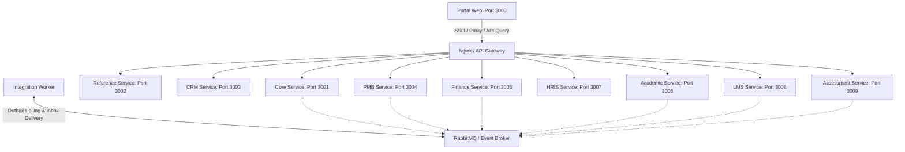

# 🏗️ Rencana & Skema Arsitektur ERP Pendidikan UNSIA

Dokumen ini memuat **Rencana Implementasi (Implementation Plan)** bertahap dan **Skema Database/Integrasi (Database Schema & Integration Mapping)** untuk ekosistem ERP Pendidikan / SIAKAD Terintegrasi Universitas Siber Asia (UNSIA).

Sistem ini dirancang menggunakan arsitektur **Modular Distributed ERP** dengan **multi-repo**, Next.js (TypeScript), Drizzle ORM, dan PostgreSQL per modul.

---

## 🗺️ Peta Sistem & Alokasi Port

Setiap modul beroperasi secara mandiri di port masing-masing dan berkomunikasi melalui API Gateway, service token, atau asinkron via event broker (RabbitMQ/Redis).



---

## 🗄️ Skema Database & Batasan Domain (No Cross-DB FK)

Setiap service memiliki database PostgreSQL sendiri. Tidak ada foreign key lintas database. Hubungan antar tabel modular menggunakan **External Reference (`*_ref_id`)**.

```
[core_db]          [reference_db]         [crm_db]             [pmb_db]
- persons          - study_programs       - campaigns          - applicants
- users            - academic_years       - agents             - applicant_biodata
- roles            - academic_periods     - leads              - applicant_documents
- permissions      - status_codes         - follow_ups         - loa_documents
- sessions         - payment_components   - referrals          - handover_logs
- service_tokens                          - commissions

[finance_db]       [academic_db]          [hris_db]            [lms_db]
- invoices         - students             - employees          - lms_classes
- invoice_items    - student_advisors     - lecturers          - lms_enrollments
- payments         - course_offerings     - lecturer_homebases - sessions
- clearances       - krs_headers                               - assignments
- scholarships     - krs_items                                 - submissions
                   - grades / transcripts                      - learning_progress
```

### 📋 Tabel Teknis Wajib di Setiap Database Modul
Agar integrasi asinkron dan audit berjalan handal, setiap database memiliki tabel standard berikut:
1. `audit_logs` — Mencatat histori aksi sensitif
2. `idempotency_keys` — Mencegah pemrosesan ganda pada request/event
3. `outbox_events` — Menyimpan data event lokal sebelum dipublish
4. `inbox_events` — Menyimpan data event luar yang telah sukses dikonsumsi
5. `reconciliation_mismatch_logs` — Melaporkan selisih snapshot vs master

---

## 🔄 Alur Bisnis End-to-End & Transisi Status

```
[CRM] Qualified Lead ──> [PMB] Applicant Created ──> Document Verified ──> Invoice Request
                                                                                  │
                                                                                  ▼
[Akademik] Student Created <── Handover <── LoA Issued <── Payment Paid <── [Finance] Invoice
       │
       ▼
[Akademik] KRS Approved ──> [LMS] Class Sync & Enrollment Sync ──> [Assessment] CBT / Quiz
```

### ⚙️ State Machines Utama

#### 1. Applicant State Machine (PMB)
`DRAFT` ➡️ `SUBMITTED` ➡️ `DOCUMENT_VERIFIED` ➡️ `ACCEPTED` ➡️ `LOA_ISSUED` ➡️ `HANDED_OVER`

#### 2. Invoice State Machine (Finance)
`DRAFT` ➡️ `ISSUED` ➡️ `PARTIALLY_PAID` ➡️ `PAID` ➡️ `CANCELLED / EXPIRED`

#### 3. KRS State Machine (Academic)
`DRAFT` ➡️ `SUBMITTED` ➡️ `APPROVED` (oleh Dosen PA) ➡️ `FINALIZED` (setelah cek Finance Clearance)

---

## 📅 Rencana Kerja Implementasi (Phased Release)

Rencana kerja ini dibagi menjadi 9 fase berurutan untuk menjamin integrasi dan dependensi modul stabil.

### Phase 0 — Arsitektur & Fondasi Infrastruktur (P0)
*   **Target:** Setup infra dasar dan template library.
*   **Tasks:**
    1.  Setup shared schema contract di `unsia-shared-contracts` (types, error codes, event payloads).
    2.  Setup PostgreSQL cluster lokal dengan Nginx gateway di `unsia-infra`.
    3.  Buat baseline middleware di core service: auth, RBAC, scope, audit, dan idempotency keys.
    4.  Generate skema tabel outbox/inbox per database.

### Phase 1 — Identitas & Master Data Utama (P0)
*   **Target:** SSO, RBAC, dan Data Referensi aktif.
*   **Tasks:**
    1.  Implementasi login, refresh, logout, dan role-switching di `unsia-core-service`.
    2.  Buat endpoint master data wilayah, prodi, dan periode akademik di `unsia-reference-service`.
    3.  Setup Portal SSO UI di `unsia-portal-web` sesuai mockup `SSO MAHASISWA.html` & `SSO SUPERADMIN.html`.

### Phase 2 — PMB, CRM & Finance Basic (P0)
*   **Target:** Pendaftaran mahasiswa baru dan pembayaran pendaftaran.
*   **Tasks:**
    1.  Lead capture di `unsia-crm-service` ➡️ convert ke applicant PMB.
    2.  Pengisian biodata & verifikasi dokumen di `unsia-pmb-service`.
    3.  Pembuatan invoice dan callback payment gateway di `unsia-finance-service`.
    4.  Event processing outbox-inbox PMB ↔️ Finance via RabbitMQ/Worker.
    5.  Build UI portal PMB & Admin Keuangan.

### Phase 3 — Handover & Onboarding Akademik (P0)
*   **Target:** Penerbitan NIM untuk applicant yang lunas.
*   **Tasks:**
    1.  LoA generation & handover execution di `unsia-pmb-service`.
    2.  Pembuatan data student dan auto-generation NIM di `unsia-academic-service`.
    3.  Integrasi pmb.ready_for_academic ➡️ student_created.

### Phase 4 — KRS, HRIS & Sinkronisasi LMS (P1)
*   **Target:** Penjadwalan, pengisian KRS, plotting dosen, dan sinkronisasi kelas online.
*   **Tasks:**
    1.  Master data dosen & staff aktif di `unsia-hris-service`.
    2.  Course offering, penjadwalan kelas, pengisian KRS di `unsia-academic-service`.
    3.  Sinkronisasi KRS approved ke `unsia-lms-service` untuk auto-enrollment kelas online.

### Phase 5 — Ujian (Assessment) & Grade Input (P1)
*   **Target:** Bank soal CBT, quiz, exam, dan pelaporan nilai.
*   **Tasks:**
    1.  Bank soal (versioned) & attempt session engine di `unsia-assessment-service`.
    2.  Integrasi kuis LMS dan ujian CBT PMB.
    3.  Sync grade input dari LMS/Assessment ke `unsia-academic-service` (sebagai draft nilai).

### Phase 6 — Nilai Final, KHS & Transkrip Akademik (P1)
*   **Target:** Rilis dokumen evaluasi studi mahasiswa.
*   **Tasks:**
    1.  Pola finalisasi nilai (oleh Biro/Kaprodi) dan generation KHS/Transkrip di `unsia-academic-service`.
    2.  Finance clearance policy enforcement untuk pemblokiran KHS/transkrip mahasiswa menunggak.

### Phase 7 — Portal Executive Dashboard & Notification (P2)
*   **Target:** Monitoring pimpinan dan push notification.
*   **Tasks:**
    1.  Notification routing engine di `unsia-portal-web`.
    2.  Dashboard read model dengan indikator data freshness (`refreshed_at`).

### Phase 8 — Hardening, UAT & Rekonsiliasi Akhir (P2)
*   **Target:** Stabilitas integrasi dan penanganan partial outage.
*   **Tasks:**
    1.  Reconciliation job worker: mendeteksi data mismatch Finance vs PMB, Academic vs LMS.
    2.  Simulasi partial outage (mematikan service DB tertentu untuk menguji fallback/degraded mode).

---

## 🛡️ Pola Query & Integrasi Data Lintas Modul

Untuk menjaga boundary modular, pola query data diatur secara tegas:

*   **Pola yang DIANJURKAN (REST / API Composition):**
    ```typescript
    // Modul PMB membaca data applicant lokal, lalu memanggil Finance API secara asinkron/sinkron
    const applicant = await db.select().from(applicants).where(eq(applicants.id, id));
    const invoice = await financeClient.getInvoiceByRefId(id);
    ```
*   **Pola yang DILARANG (Cross-DB SQL Join):**
    ```sql
    -- Query ini dilarang keras karena merusak boundary DB dan isolasi modul
    SELECT * FROM pmb_db.applicants a 
    JOIN finance_db.invoices i ON i.bill_to_ref_id = a.id;
    ```

---

## 📈 Rencana Verifikasi & Acceptance Criteria Utama

1.  **Partial Outage Resilience:** Matikan `finance_db`, modul PMB harus tetap bisa memproses pengisian biodata & verifikasi berkas; UI hanya akan menampilkan label "Finance service is currently degraded".
2.  **Strict Idempotency:** Callback payment gateway atau handover akademik yang dikirim berulang tidak boleh menghasilkan data ganda.
3.  **Core SSO Validation:** User dapat berganti active role (contoh: Dosen PA ➡️ Dosen Biasa), dan hak akses data scope (study_program_id / assigned_class) langsung berubah di backend.
